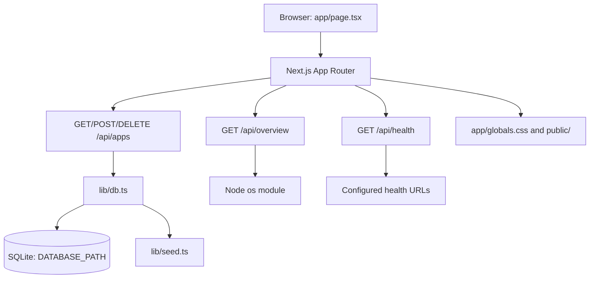

# Project Overview

Nimbus is a local-first Next.js dashboard for launching and monitoring web apps hosted on a
home server. It provides a browser UI for managing an application registry, stores that registry
in a server-side SQLite database, exposes lightweight system and health APIs, and can be run with
Node.js or Docker Compose; its elevator pitch is a private home-server control panel that keeps
every service visible and reachable from one place.

## Repository Structure

- `app/` — Next.js App Router pages, shared browser styles, and API route handlers.
  - `app/page.tsx` — client-side dashboard UI, filtering, health refresh, and app management.
  - `app/layout.tsx` — root document layout and metadata.
  - `app/globals.css` — global dashboard styles and responsive layout rules.
  - `app/api/` — server-side JSON endpoints for apps, health checks, and system overview.
- `lib/` — server/database helpers, seed data, and shared TypeScript domain types.
- `data/` — local SQLite runtime files; database files are ignored by Git.
- `public/` — static assets served by Next.js; currently contains only `.gitkeep`.
- `.next/` — generated Next.js build and development output; do not edit by hand.
- `Dockerfile` — multi-stage Node 24 Alpine image build and non-root production runtime.
- `docker-compose.yml` — local deployment definition with a named persistent data volume.
- `next.config.ts` — Next.js configuration, including standalone output.
- `package.json` / `package-lock.json` — npm metadata, scripts, and locked dependencies.
- `tsconfig.json` — strict TypeScript compiler settings and the `@/*` path alias.
- `.env.example` — documented environment variable names and local defaults.
- `.github/workflows/ci.yml` — GitHub Actions jobs for lint and build on `main` pushes and pull
  requests.
- `README.md` — user-facing local run, Docker deployment, and application setup notes.

## Build & Development Commands

Install dependencies (the documented command is):

```bash
npm install
```

Build and run the production server:

```bash
npm run build
npm run start
```

Run the development server (the documented command is):

```bash
npm run dev
```

Run the current lint/type-check script. Despite its name, `lint` currently invokes TypeScript:

```bash
npm run lint
```

Run an explicit TypeScript check without emitting files:

```bash
npm exec tsc -- --noEmit
```

Debug the development server with Node’s inspector:

```bash
NODE_OPTIONS=--inspect npm run dev
```

Tests:

```bash
# TODO: No test script, test runner, or repository test suite is currently defined.
```

Deploy with Docker Compose (the documented command is):

```bash
docker compose up -d --build
```

The local app is available at `http://localhost:3000`. Node.js 24+ is required because the
SQLite implementation uses the built-in `node:sqlite` API. The Docker image also uses Node 24.

## Code Style & Conventions

- Use TypeScript with strict compiler checking and React components in `.tsx` files.
- Prefer the existing App Router layout: UI in `app/`, API handlers under `app/api/**/route.ts`,
  and reusable server/domain code in `lib/`.
- Use the `@/*` import alias for repository-root imports, as configured in `tsconfig.json`.
- Keep server-only database code isolated from client components; `lib/db.ts` explicitly imports
  `server-only`.
- Match the existing concise functional-component style, double-quoted imports, semicolons, and
  two-space indentation.
- Use `camelCase` for variables and functions, `PascalCase` for React components and types, and
  `SCREAMING_SNAKE_CASE` only for true constants.
- Use kebab-case for route and data identifiers such as `app/api/health` and `healthUrl` for the
  corresponding TypeScript field.
- Keep API responses JSON-shaped and validate required request fields before database writes.
- `npm run lint` is the repository’s current validation script, but it runs `tsc --noEmit`; no
  ESLint configuration file is present.
- Do not hand-edit generated `.next/` output, SQLite runtime files, or `tsconfig.tsbuildinfo`.
- Commit-message template: `> TODO: No repository commit-message convention is documented.`

## Architecture Notes



The browser renders the dashboard and initially loads the application registry and server
overview from the API routes. App changes are sent to `/api/apps`, whose handlers delegate to the
singleton `DatabaseSync` connection in `lib/db.ts`; the database creates its schema and seeds
from `lib/seed.ts` when empty. The overview endpoint derives uptime, load-based CPU, and memory
from the Node process host, while the health endpoint fetches each configured HTTP(S) health URL
and returns `online`, `degraded`, or `offline`. The client refreshes health checks every 30
seconds and can trigger one manually. Next.js is built as a standalone server for the container
runtime, and Docker Compose persists SQLite data in the `nimbus-data` named volume.

## Testing Strategy

Unit tests:

- No unit-test framework, test files, or test script is currently present.
- `> TODO: Add unit coverage for database row mapping, uptime formatting, request validation,
  and health-status classification.`

Integration tests:

- The API routes are the main integration boundary: `/api/apps`, `/api/health`, and
  `/api/overview`.
- `> TODO: Add an integration runner and document the command for exercising these routes with a
  temporary `DATABASE_PATH`.`

End-to-end tests:

- No browser E2E tool or suite is configured.
- `> TODO: Add an E2E tool and cover loading the dashboard, adding/editing/deleting an app,
  filtering, and health refresh behavior.`

Local verification currently consists of `npm run lint`, `npm run build`, and a manual smoke test
against `http://localhost:3000` after `npm run dev` or `npm run start`. CI runs `npm ci`,
`npm run lint`, and `npm run build` on pushes and pull requests targeting `main`.

## Security & Compliance

- Keep runtime secrets and machine-specific values in `.env`; `.env*` is ignored except for
  `.env.example`. Never commit credentials, private keys, tokens, or production database files.
- `DATABASE_PATH` selects the SQLite file. In Compose it is `/app/data/nimbus.db`, persisted by
  the `nimbus-data` volume; local database files under `data/` are ignored.
- `DOCKER_SOCKET` is documented for future discovery, but the current Compose socket mount is
  commented out. Do not enable Docker socket access without an explicit security review because
  the socket grants powerful control over the host.
- `/api/health` accepts caller-supplied HTTP(S) URLs and makes server-side requests. Treat this as
  an SSRF boundary: validate and constrain allowed destinations before exposing Nimbus beyond a
  trusted LAN, and do not weaken the protocol check or timeout casually.
- The health endpoint has a 4.5-second request timeout; preserve bounded network calls and add
  rate limiting or authentication before making the endpoint internet-facing.
- Dependency scanning, lockfile auditing, and vulnerability thresholds are not configured.
  `> TODO: Define the approved dependency scanner and required CI policy.`
- No `LICENSE` file or third-party license policy is present. `> TODO: Add the project license and
  document attribution requirements before redistribution.`

## Agent Guardrails

- Do not edit `.next/`, `node_modules/`, SQLite files under `data/`, or `tsconfig.tsbuildinfo`;
  they are generated or runtime artifacts.
- Do not add credentials, local hostnames, private URLs, or secrets to tracked source, fixtures,
  documentation, or `.env.example`.
- Preserve the existing `DATABASE_PATH` behavior and SQLite schema compatibility. Database schema
  changes require an explicit migration plan; do not silently delete or recreate user data.
- Do not enable the Docker socket mount, broaden health-check network access, or expose new
  privileged endpoints without explicit security review.
- Keep changes scoped to the requested behavior and run `npm run lint` plus `npm run build` for
  TypeScript or runtime-affecting changes.
- Any change to API validation, persistence, container permissions, network access, or deployment
  configuration requires human review before merge.
- No repository rate-limit policy is currently defined. `> TODO: Set request limits for health
  checks and mutation endpoints before public exposure.`
- No files are designated as permanently immutable beyond generated/runtime artifacts above.
  `> TODO: Record any product-owned or deployment-owned files that agents must never change.`

## Extensibility Hooks

- Add or edit application records through the `/api/apps` GET, POST, and DELETE route handlers;
  `ManagedApp` in `lib/types.ts` is the shared extension point.
- Seed or change default applications in `lib/seed.ts`. The seed is inserted only when the SQLite
  `apps` table is empty.
- `DATABASE_PATH` selects the SQLite database location.
- `DOCKER_SOCKET` is reserved for future Docker Compose discovery; discovery is not implemented,
  and the socket mount remains commented out in `docker-compose.yml`.
- Next.js standalone output is configured in `next.config.ts`, and the `public/` directory is the
  static-asset hook.
- No feature-flag system, plugin loader, or documented event hook exists. `> TODO: Define feature
  flag and plugin conventions before adding runtime extensibility.`

## Further Reading

- [README.md](README.md) — local development, Docker deployment, and app setup.
- [Dockerfile](Dockerfile) — build stages, runtime user, and production entrypoint.
- [docker-compose.yml](docker-compose.yml) — container settings and persistent storage.
- [lib/types.ts](lib/types.ts) — shared application and server overview types.
- `> TODO: Add [docs/ARCH.md](docs/ARCH.md) when a deeper architecture document exists.`
- `> TODO: Add an ADR directory and link the decisions governing persistence, health checks, and
  future Docker discovery.`
