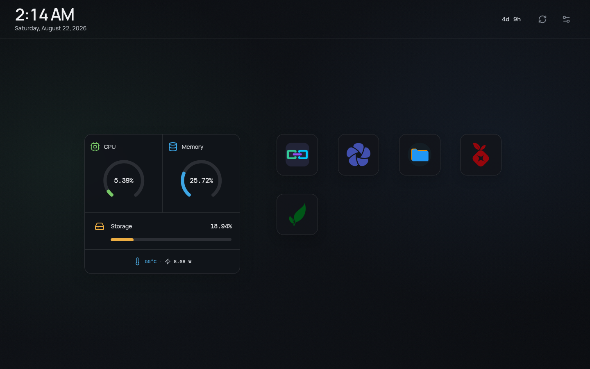

# Nimbus

Nimbus is a local-first launcher for the web apps hosted on your home server. It keeps service
links, health status, and basic system metrics in one calm home screen.

## Features

- Kiosk-friendly service launcher with custom icons and local-host URL resolution
- CPU, memory, storage, uptime, temperature, and power overview
- Automatic service-health refresh and recent activity history
- Application management with SQLite persistence and optional Docker/Compose discovery
- Processor and memory detail views with sortable process tables

## Preview



## Run locally

Node.js 24+ is required for the built-in `node:sqlite` API.

```bash
npm install
npm run dev
```

Open [http://localhost:3000](http://localhost:3000), then use the settings control to register a
service. The first request creates and seeds the SQLite database when it is empty.

## Run with Docker Compose

```bash
docker compose up -d --build
```

The SQLite database is stored in the persistent `nimbus-data` volume. The metrics agent reads host
process and sysfs data through read-only mounts. Keep Nimbus behind a trusted LAN, VPN, or reverse
proxy before exposing it outside your home network; health and icon routes make bounded server-side
requests to configured service URLs.

## Verification

```bash
npm test
npm run lint
npm run build
```

`npm test` covers the discovery, validation, database-row, URL, and metrics helpers. Browser smoke
testing should cover the launcher at desktop and mobile sizes, application management, and system
detail modals.
