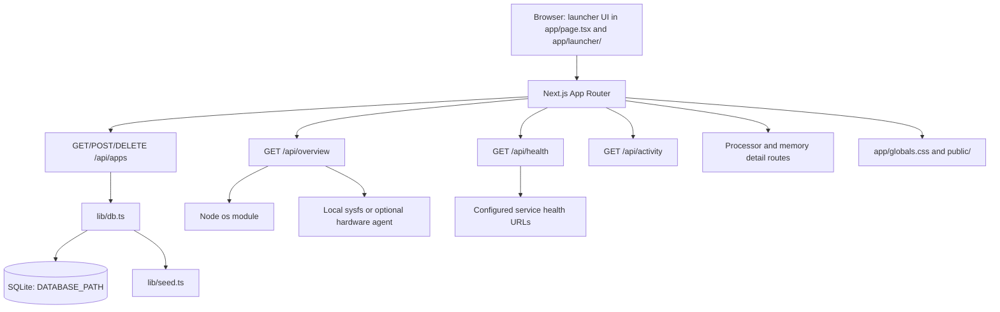

# Architecture

Nimbus is a local-first launcher for web applications hosted on a home server. It combines
service links, health status, activity history, and basic host metrics in one home screen.

## Runtime flow

The browser initially loads the application registry and server overview. Application changes are
sent to `/api/apps`, whose handlers delegate to the singleton `DatabaseSync` connection in
`lib/db.ts`. The database creates its schema and seeds `lib/seed.ts` only when the `apps` table is
empty.

The overview endpoint derives uptime, CPU, memory, and filesystem storage from the host. Hardware
telemetry uses local sysfs data and can fall back to an optional hardware agent configured through
`HARDWARE_AGENT_URL`. The health endpoint checks each configured HTTP(S) target and reports
`online`, `degraded`, or `offline`. The client refreshes overview data every five seconds and
health data every thirty seconds; system detail modals refresh process data every five seconds.

## Main components

- `app/page.tsx`: launcher state, polling, application mutations, and modal orchestration.
- `app/launcher/`: launcher tiles, settings, icons, activity, and display helpers.
- `app/system-details-modal.tsx`: sortable CPU and memory process views.
- `app/api/apps/`: application CRUD API.
- `app/api/health/`: configured service health checks.
- `app/api/overview/`: host overview metrics.
- `app/api/activity/`: recent activity history.
- `app/api/processor/processes/` and `app/api/memory/processes/`: process detail APIs.
- `agent/`: host metrics and optional Docker/Compose discovery helpers.
- `lib/db.ts`: server-only SQLite access.
- `lib/seed.ts`: default application records.
- `lib/types.ts`: shared application and telemetry types.

## Persistence and deployment

`DATABASE_PATH` selects the SQLite file. Local development defaults to `data/nimbus.db`; Docker
Compose stores the database at `/app/data/nimbus.db` in the persistent `nimbus-data` named volume.

Next.js is built as a standalone server for the container runtime. The default Compose file does
not mount the Docker socket. Optional Docker/Compose discovery must remain read-only unless a
separately reviewed control path is introduced.

## Extension points

- Add or edit application records through the `/api/apps` route handlers.
- Extend the `ManagedApp` type in `lib/types.ts` when application metadata needs to grow.
- Change default applications in `lib/seed.ts`.
- Use `DATABASE_PATH` for deployment-specific database placement.
- Use `public/` for static assets.

There is currently no feature-flag system, plugin loader, or general event hook.
