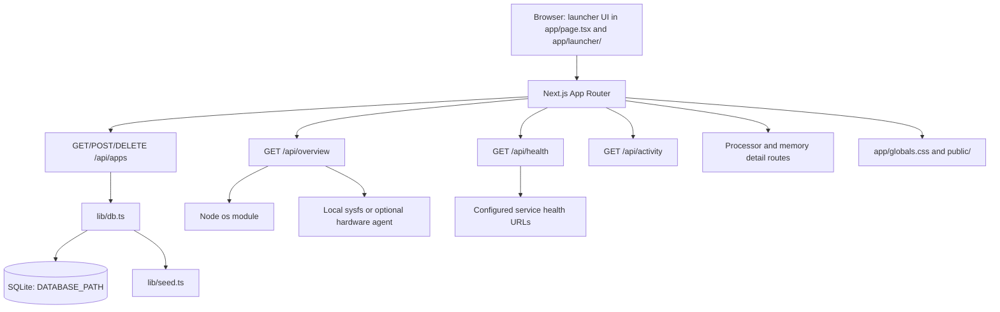

# Architecture

Nimbus is a local-first launcher for web applications hosted on a home server. It combines
service links, health status, activity history, and basic host metrics in one home screen.

## Runtime flow

The browser initially loads the application registry and server overview. Application changes are
sent to `/api/apps`, whose handlers delegate to the singleton `DatabaseSync` connection in
`lib/db.ts`. The database creates its schema and seeds `lib/seed.ts` only when the `apps` table is
empty.

The registry, activity, overview, and health routes remain separate. Operational API responses are
not cached by the service worker. Overview sampling uses a two-second in-process TTL with
in-flight request coalescing; this limits duplicate host probes while preserving a fresh response
for the five-second dashboard refresh. The response's `updatedAt` is the sampling time, not the
time a cached response was served. Health requests explicitly use `no-store`, retain last-known
statuses on failed checks, skip overlapping client refreshes, and run with a maximum of eight
concurrent checks. Activity is refreshed only when a successful health cycle changes an app status.
Docker discovery has an agent-side deadline, bounded concurrent container inspection, bounded
Compose traversal, and a short server-side fallback budget so optional discovery cannot block the
local application registry indefinitely.
Health polling pauses while the document is hidden and performs one refresh when the page becomes
visible again; overview polling retains its five-second cadence.

The overview endpoint derives uptime, CPU, memory, and filesystem storage from the host. Hardware
telemetry uses local sysfs data and can fall back to an optional hardware agent configured through
`HARDWARE_AGENT_URL`. The health endpoint checks each configured HTTP(S) target and reports
`online`, `degraded`, or `offline`. The client refreshes overview data every five seconds and
health data every thirty seconds; system detail modals refresh process data every five seconds.

Metric history charts are mounted only inside processor and memory detail modals. Opening a chart performs one no-store history read; the Live selection reads the rolling five-minute window again every 30 seconds while the modal remains open, while 15m and 30m read once when selected. Unmounting the modal clears the timer and aborts any in-flight chart request. History samples are still recorded by overview sampling at the existing one-minute cadence and are retained for 30 days.

## Main components

- `app/page.tsx`: launcher state, polling, application mutations, and modal orchestration.
- `app/launcher/`: launcher tiles, settings, icons, activity, and display helpers.
- `app/system-details-modal.tsx`: sortable CPU and memory process views.
- `app/api/apps/`: application CRUD API.
- `app/api/health/`: configured service health checks.
- `app/api/overview/`: host overview metrics.
- `app/api/activity/`: recent activity history.
- `app/api/processor/processes/` and `app/api/memory/processes/`: process detail APIs.
- `agent/`: host metrics and optional Docker/Compose discovery helpers.
- `lib/db.ts`: server-only SQLite access.
- `lib/seed.ts`: default application records.
- `lib/types.ts`: shared application and telemetry types.

## Persistence and deployment

`DATABASE_PATH` selects the SQLite file. Local development defaults to `data/nimbus.db`; Docker
Compose stores the database at `/app/data/nimbus.db` in the persistent `nimbus-data` named volume.

Next.js is built as a standalone server for the container runtime. The default Compose file does
not mount the Docker socket. Compose uses project-scoped container names derived from the Compose
project, so separate deployments can coexist without fixed container-name collisions. The web
host binding is controlled by `NIMBUS_BIND_ADDRESS` (default `0.0.0.0`) and `NIMBUS_PORT` (default
`10000`); these affect only the published host port. Optional Docker/Compose discovery must remain
read-only unless a separately reviewed control path is introduced.

`apps.is_favorite` is retained as an inert legacy SQLite column for compatibility with existing
files and newly initialized databases. It is not selected into `ManagedApp`, accepted as an API
field, written by the application contract, seeded, or rendered. This release performs no
destructive schema migration. A future physical removal requires a versioned migration with
backup, rollback, old/new schema tests, and explicit deployment coordination. Activities and metric
history remain separate from the application contract; metric samples retain their existing
30-day policy. App and Docker discovery responses are private/no-store; Docker agent reads are
short-TTL coalesced and capped to prevent repeated unbounded reconciliation work.

## Extension points

- Add or edit application records through the `/api/apps` route handlers.
- Extend the `ManagedApp` type in `lib/types.ts` when application metadata needs to grow.
- Change default applications in `lib/seed.ts`.
- Use `DATABASE_PATH` for deployment-specific database placement.
- Use `public/` for static assets.

There is currently no feature-flag system, plugin loader, or general event hook.
Activity records are retained for 90 days and capped at the newest 1,000 rows. Pruning runs after
activity writes, not during the five-second overview polling path. SQLite remains a single-process
WAL-backed store; this policy does not claim multi-writer coordination.

Process detail collection uses a 32-worker filesystem-read bound, scans at most 1,024 process
directories per snapshot, and returns at most the top 256 rows after sorting. Responses expose
`totalCount`, `returnedCount`, `unreadableCount`, and `policyOmittedCount` with a reason so a capped
list is never presented as all readable processes. Agent responses are bounded to 512 KiB and
cancel when the downstream request closes; the process table keeps its accessible sorting and
partial/error states.
